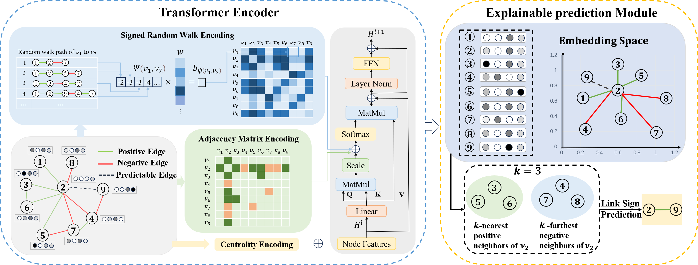

# SE-SGformer
[Paper](https://github.com/liule66/SE-SGformer/blob/main/pdf/paper.pdf)  | [Poster](https://github.com/liule66/SE-SGformer/blob/main/pdf/poster.pdf)

Official code implementation of AAAI 2025 paper "**Self-Explainable Graph Transformers for Link Sign Prediction**".This work presents SE-SGformer, a self-explainable framework for signed graphs. It introduces a new Transformer architecture with positional encoding based on signed random walks, offering superior expressive power over existing methods. SE-SGformer replaces neural network-based decoders with a novel decision process that uses $K$-nearest (farthest) neighbors to predict edge signs, providing critical interpretability in decision-making.The overall architecture of SE-SGformer is illustrated as follows:




## Environment Setup


```shell
pip install -r requirements.txt
```


- Python 3.9.12
- torch = 2.3.1
- numpy~=1.26.4
- scikit-learn~=1.5.1
- pandas~=2.2.2
- tqdm~=4.64.0
- scipy~=1.10.1
- torch_geometric~=2.5.3
- torchvision~=0.18.1
- torchaudio~=2.3.1

## Datasets

Datasets are provided in the `dataset` folder. We divided the dataset five times, with each division splitting the training and test sets at an 8:2 ratio. Five experiments were conducted, and the average of the results was taken.

## Running the Code

To run the encoder module:
```shell
python main.py 
```

To run the decoder module:
```bash
python -u discriminator.py --dataset Epinions --offset 4
```
dataset:Epinions, amazon-music, KuaiRand, KuaiRec,soc-sign-bitcoinotc,soc-sign-bitcoinalpha,WikiElec,WikiRfa
offset: for Epinions and amazon-music,offset=4,for KuaiRand and KuaiRec , offset  = 1 , for others , offset = 0.
Here, "offset" refers to the threshold used to distinguish between positive and negative edges.


```bash
python -u discriminator.py --dataset Epinions --offset 4
```
```bash
python -u discriminator.py --dataset amazon-music --offset 4
```
```bash
python -u discriminator.py --dataset KuaiRand --offset 1
```
```bash
python -u discriminator.py --dataset KuaiRec --offset 1
```
```bash
python -u discriminator.py --dataset BitcoinOTC --offset 0
```
```bash
python -u discriminator.py --dataset Bitcoin-alpha --offset 0
```
```bash
python -u discriminator.py --dataset WikiElec --offset 0
```

```bash
python -u discriminator.py --dataset WikiRfa --offset 0
```
